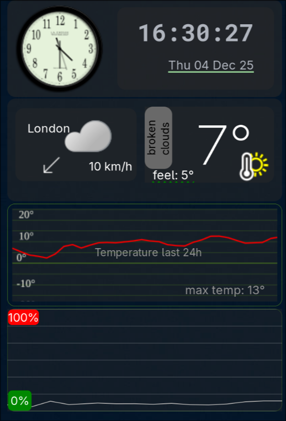

# EWW Clock Widget

A simple clock widget for [eww](https://github.com/elkowar/eww) (Elkowar's Wacky Widgets), a standalone widget system for Linux.


## Features

- Displays current time and date
- Animated clock
- Customizable appearance via eww configuration
- Lightweight and efficient

## Prerequisites

- [eww](https://github.com/elkowar/eww) installed on your system
- Linux environment

## Installation

1. Clone or download this repository.
2. Copy the contents of this directory to your eww configuration directory, typically `~/.config/eww/`.
3. Ensure the widget files are in a subdirectory, e.g., `~/.config/eww/clock/`.

## Usage

1. Start eww with your configuration.
2. The clock widget should appear as defined in your eww configuration files (e.g., `eww.yuck` and `eww.scss`).
3. Run eww: `eww open clock` (adjust based on your setup).

## Configuration

- Modify the Lua scripts or Yuck files to customize the clock's behavior and appearance.
- Refer to the eww documentation for advanced customization.

## Contributing

Feel free to submit issues or pull requests for improvements.

## License

This project is licensed under the MIT License - see the LICENSE file for details.
```
